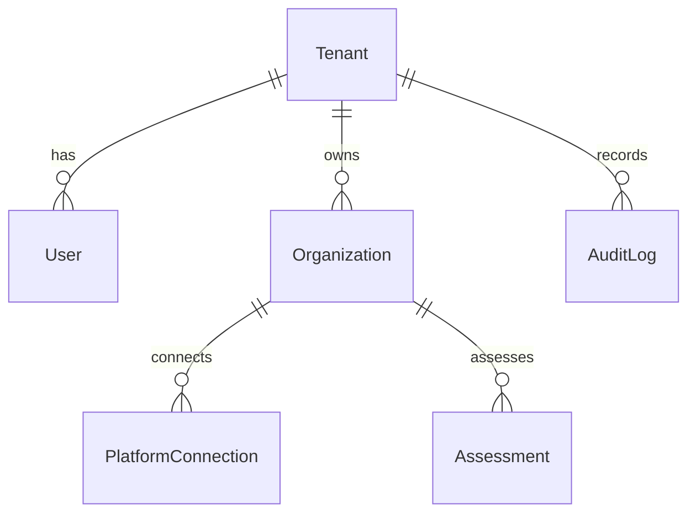

# Minimum Database Schema

Provider: Supabase Postgres only (project `ppceqvoyexpkguzeseen`, `us-east-2`). SQL in `sql/migrations` is the schema. The app queries Postgres with `postgres` (postgres.js). There is no local or Docker Postgres, and no Prisma.

- `DATABASE_URL` uses the transaction pooler (`:6543`, `pgbouncer=true`).
- `DIRECT_URL` uses session mode on the pooler (`:5432`) for migrations.
- Enigma tables have RLS enabled and grants revoked from `anon` / `authenticated`. The Next.js app talks to Postgres as the database owner, not through PostgREST. Do not query tenant tables with the anon key.
- `User.id` is the Supabase Auth user id. Passwords live in `auth.users`, not in Enigma tables.

## Sprint 1 entities

| Table | Purpose |
| --- | --- |
| `Tenant` | Partner org (the firm). AEs, RVPs, and partners on this org share customers and projects. |
| `User` | Authenticated Enigma user, always scoped to one tenant. Optional `avatarPath` points at an object in the Supabase Storage `profiles` bucket (`{tenantId}/{userId}/avatar.{ext}`). Uploads go through the server with the service role; keep the bucket private. |
| `Organization` | Account being assessed (the customer's company) |
| `PlatformConnection` | Generic connection to an enterprise platform |
| `Assessment` | One analysis run against an organization |
| `AuditLog` | Tenant-scoped security and activity trail |

`PlatformConnection.platformType` is an enum (`SALESFORCE` first). Encrypted tokens and a deletable metadata snapshot are Sprint 2.

## Tenant isolation rule

Every customer-owned table includes `tenantId` and an index on `tenantId`.

Server queries must include `{ tenantId }` from the session. Frontend filtering is not sufficient.

## Later tables (not created in Sprint 1)

- Normalized discovery: `EnterpriseObject`, `Field`, `Automation`, `KnowledgeSource`, `BusinessProcess` (deletable snapshot behind MCP)
- Intelligence: `ReadinessAssessment`, `ReadinessDimension`, `Opportunity`, assessment run / tool-trace records (no tokens, no raw Salesforce HTTP)
- Economics: `ConsumptionModel`, `ConsumptionScenario`, `ValueModel`
- Delivery: `Recommendation`, `Roadmap`, `RoadmapPhase`, `ExecutiveBrief`

These belong to an `Assessment` and inherit `tenantId`. MCP denials and tool calls also write to `AuditLog`.

## Pricing

No pricing constants live in the database seed or application code as if they were official Salesforce prices. Consumption unit prices are customer-specific assumptions, introduced in Sprint 4 as configurable model inputs.
